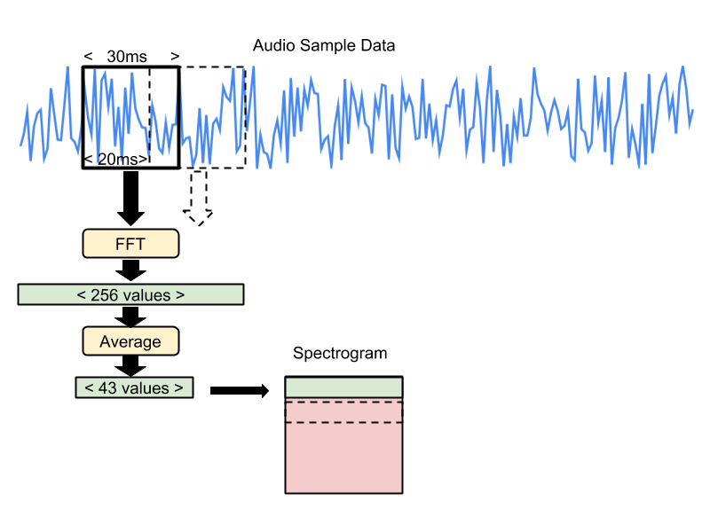
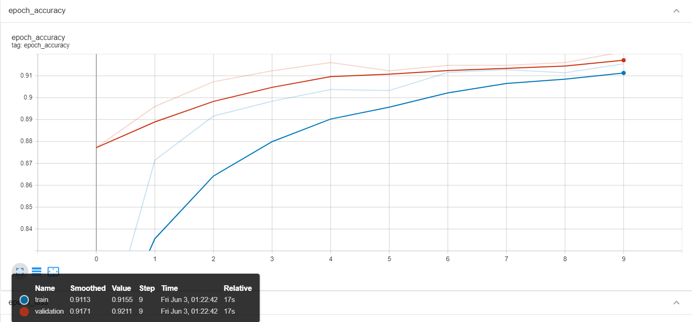
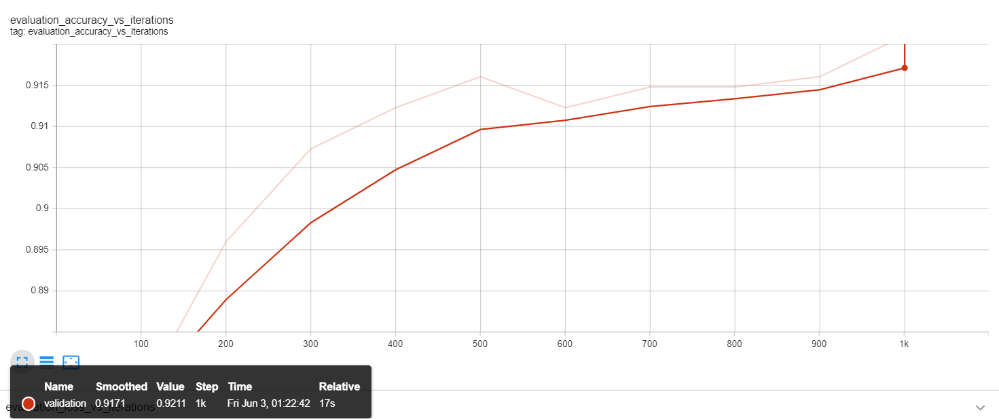

<h1 align="center">
  <a href="https://github.com/OSobky/speech-recognition-AWS">
    <!-- Please provide path to your logo here -->
    
    
  </a>
</h1>

  Speech Recognition AWS end-to-end solution on PSoC6
   
  <a href="#about"><strong>Explore the screenshots »</strong></a>
   
   

Table of Contents

- [Introduction](#introduction)
  - [Motivation](#motivation)   
  - [Objective](#objective)   
- [Methodology](#methodology)
   - [Prerequisites](#prerequisites)
   - [Data Acquisition & storage in AWS](#data-acquisition--storage-in-aws)
   - [Model Training in AWS](#model-training-in-aws)
- [Results](#about)
- [Conclusion](#about)
- [Authors & contributors](#authors--contributors)
- [Acknowledgements](#acknowledgements)

---

# Introduction

## Motivation

<table><tr><td>

Machine Learning has found numerous real-world applications, but bringing the power of
Machine Learning to resource constrained and small footprint is still challenging. There are
many limiting factors to the deployment of ML models on microcontrollers such as libraries
used by the model, programming the microcontroller, data types, and etc. This IDP will be
completed in cooperation with XXXXXXX, we will use Infineon PSoC6 board, shown
in Figure below, to recognise Keywords "yes" & "no" using a Machine Learning Model created on
AWS. The application listens to its surroundings with a microphone and indicates when it has
detected a word by lighting an LED or displaying data on a screen, depending on the
capabilities of the device.

 

Screenshots

 

> **[?]**
> Please provide your screenshots here.

|                               Home Page                               |                               Login Page                               |
| :-------------------------------------------------------------------: | :--------------------------------------------------------------------: |
|  |  |

</td></tr></table>

## Objective 
 

Our objective is to showcase the AWS Infrastructure for generating a model, and to demonstrate
the capabilities of the Infineon PSoC6 microcontroller. In this project, we will try to overcome
some of the challenges faced in the deployment of ML models to microcontrollers by using
microcontroller libraries. We will build an end-to-end ML solution which will showcase the
whole ML pipeline from collecting and preprocessing data to building a model using AWS
SageMaker and then deploying the created model to a microcontroller. The following Diagram shows the project workflow.

 

 

# Methodology 

In this section we will discuss the milestones/phases needed for this project.

#### The different phases for the end-to-end example are described below: ####

1. [Data Acquisition & storage in AWS](#1-data-acquisition--storage-in-aws)
    1. We will be using Speech Command dataset provided by Google
    2. The dataset will be stored in Amazon S3 Bucket.
2. [Data pre-processing using AWS SageMaker Processing Jobs](#2-data-preprocessing-using-aws-sagemaker-processing-jobs)
3. ML Training using AWS SageMaker Training Jobs
4. ML Deployment Web using AWS SageMaker End-Points
5. ML Deployment PSoC6 board
    1. Data in: Getting data from the PSoC6 microphone and sending it to pre-processing
    2. Pre-processing: Feature engineering
    3. ML Inference: Using the deployed model on the board
    4. Post-processing: Converting inference output to UART/LED
    
 

 

Before disucssing the details of each milestone, let's discuss the prerequisites for this project.

## Prerequisites

The following list is essintial for this project:
- AWS Account
- PSoC6 6 board
- Modus Tool Box (MTB)

In the following sections, we will disscuss how each milestone done and the challanges faced in each one.

## 1. Data Acquisition & storage in AWS

First we will speak about the datasets used and then how to move the data to AWS. 

### Speech Commands Dataset

For this project, we uses the Speech Commands dataset, a dataset created by Google which contains around 65,000 one-second long audios of 30 short words (Yes, No, and etc.) said by thousands different people. However, for development we uses Mini-Speech Commands Dataset (~1k) to develop the whole pipeline then re-run it with the original dataset.

### Amazon Simple Storage Service (Amazon S3)

One of our main focus is showcasing AWS services specifically AWS SageMaker. There is a multiple way to stream data to SageMaker, in this project we will be using Amazon Simple Storage Service (Amazon S3) as our storage on AWS as it is the best for our use-case. 

 
the following are multiple ways to upload data to S3 bucket.

- #### Downloaded dataset locally then upload the required data using the UI ####
- Use the command line locally 
- Use the EC2 if the internet is slow
- Write a lambda function to download, extract required files, then upload them

In this project, we uses the first way in the previous list to upload data to S3 bucket. Now we have our data in S3 bucket, then it's time to use AWS SageMaker for preprocessing, training, and deployment. 

 

## 2. Data preprocessing using AWS SageMaker Processing Jobs

In this section, we dissucs the preprocessing techniques and how to use Processing Jobs for preprocessing in SageMaker. However, Beforehand we will dissucss what is SageMaker.

### SageMaker

- Fully managed ML service, consisting of multiple services. Used for:
    - Label
    - Build/Develop
    - Train
    - Deploy 

- Studio = Managed EC2 Instance (Virtual Machine) + Managed EBS Volume (Storage)

- We will be using also Processing Jobs, Training Jobs, Endpoints provided by SageMaker

we will use SageMaker Studio for the development. The following diagram illustrates the workflow within SageMaker

 

### Spectrograms

 

The model doesn't take in raw audio sample data, instead it works with spectrograms which are two dimensional arrays that are made up of slices of frequency information, each taken from a different time window.

The recipe for creating the spectrogram data is that each frequency slice is created by running an FFT across a 30ms section of the audio sample data. The input samples are treated as being between -1 and +1 as real values (encoded as -32,768 and 32,767 in 16-bit signed integer samples).

This results in an FFT with 256 entries. Every sequence of six entries is averaged together, giving a total of 43 frequency buckets in the final slice. The results are stored as unsigned eight-bit values, where 0 represents a real number of zero, and 255 represents 127.5 as a real number.

Each adjacent frequency entry is stored in ascending memory order (frequency bucket 0 at data[0], bucket 1 at data[1], etc). The window for the frequency analysis is then moved forward by 20ms, and the process repeated, storing the results in the next memory row (for example bucket 0 in this moved window would be in data[43 + 0], etc). This process happens 49 times in total, producing a single channel image that is 43 pixels wide, and 49 rows high.

You can see the whole preporcessing procedure in [data-exploration.ipynb](data-exploration.ipynb)

 

### Processing Jobs

To analyze data and evaluate machine learning models on Amazon SageMaker, use Amazon SageMaker Processing. With Processing, you can use a simplified, managed experience on SageMaker to run your data processing workloads, such as feature engineering, data validation, model evaluation, and model interpretation. You can also use the Amazon SageMaker Processing APIs during the experimentation phase and after the code is deployed in production to evaluate performance.

 

The preceding diagram shows how Amazon SageMaker spins up a Processing job. Amazon SageMaker takes your script, copies your data from Amazon Simple Storage Service (Amazon S3), and then pulls a processing container. The processing container image can either be an Amazon SageMaker built-in image or a custom image that you provide. The underlying infrastructure for a Processing job is fully managed by Amazon SageMaker. Cluster resources are provisioned for the duration of your job, and cleaned up when a job completes. The output of the Processing job is stored in the Amazon S3 bucket you specified.

We use processing jobs for preprocessing in this project. You can see how to create and run a processing job in [preprocessing-job.ipynb](preprocessing-job.ipynb) file

 

## Model Training in AWS
 

In this section, we will dissucs the model architcture and how to use Training Jobs for preprocessing in AWS SageMaker.
 

### Model architcture
 

This is a simple model comprising of a Convolutional 2D layer, a Fully Connected Layer or a MatMul Layer (output: logits) and a Softmax layer (output: probabilities) as shown below. Refer to the tiny_conv model architecture.

 

This image was derived from visualizing the 'model_2.tflite' file in Netron

This doesn't produce a highly accurate model, but it's designed to be used as the first stage of a pipeline, running on a low-energy piece of hardware that can always be on, and then wake higher-power chips when a possible utterance has been found, so that more accurate analysis can be done. Additionally, the model takes in preprocessed speech input as a result of which we can leverage a simpler model for accurate results.

 

### Training Jobs

To train a model in SageMaker, you create a training job. The training job includes the following information:

- The URL of the Amazon Simple Storage Service (Amazon S3) bucket where you've stored the training data.
- The compute resources that you want SageMaker to use for model training. Compute resources are ML compute instances that are managed by SageMaker.
- The URL of the S3 bucket where you want to store the output of the job.
- The Amazon Elastic Container Registry path where the training code is stored.

The figure below shows the whole workflow for training and deployment using AWS SageMaker.

 

 

 

There are multiple options for training algorithms:
- Built-in Algorithm
    - SageMaker provides dozens of built-in training algorithms and hundreds of pre-trained models. If one of these meets your needs, it's a great out-of-the-box solution for quick model training. 
- ##### Script Mode #####
    - You can submit custom Python code that uses TensorFlow, PyTorch, or Apache MXNet for model training.
- Docker container
    - Put your code together as a Docker image and specify the registry path of the image in a SageMaker
- AWS Marketplace
    - You can use algorithms published on AWS Marketplace by different entities
- Notebook instance 
    - Train in the notebook instance itself

 

We use the script mode with TensorFlow in this project. You can see how to create and run a training job in [training-job.ipynb](training-job.ipynb) file
 

### Model Evaluation and Testing

For training and testing tracking we used Tensorboard with SageMaker Studio. Please refer to the figures below for the training and test metrics. As the main goal of this project is not the model accuracy, we will not dive deep into the model evaluations.

Training/Testing accuracy  and Confusion Matrix

 

> **[?]**
> Please provide your screenshots here.

|                               Training accuracy                       |                         Testing accuracy                               |
| :-------------------------------------------------------------------: | :--------------------------------------------------------------------: |
|  |  |
|                               Confusion Matrix                       |
|  |

 

## ML Deployment Web using AWS SageMaker End-Points

As you can see in the the training and deployment figure above, the trained model now is in the S3 bucket (Model Artifact) and now we can use SageMaker to deploy the model. In this section we will discuss AWS SageMaker endpoints and the which one did we use. the following are the list of whole deployment methods provided by SageMaker:
- #### SageMaker real-time hosting services ####
- Serverless Inference
- SageMaker Asynchronous Inference
- SageMaker batch transform

We used the real-time hosting for inference. SageMaker SDK make it very easy to deploy the model. To deploy the model you only need to run the following command  `model.deploy()`. Please check [deploy-model.ipynb](deploy-model.ipynb) file to check how to create/delete an endpoint and how to inference from it.

 

## ML Deployment PSoC6 board 

In this section, we will discuss how to deploy the created model to PSoC6 board. Deploying the model to the PSoc6 boards needs multiple steps, which are:

1. Create a TF Lite model from the Model artifact
    1. with Quantization
    2. Without Quantization
2. Generate a C Model 
3. Use pre-processing and post-processing C blocks
4. Deploy to PSoC6 using MTB

 

The preceeding diagram shows the whole pipeline done by the micro controller.

Before diving deep into how to deploy the model, we need to clarify the following. The main goal of this project is to showcase AWS and deploy the model to PSoC 6 board. Therefore, in step 4 we are using pre-processing and post-processing C blocks which were already implemented by Google example. However, we took a different approach for preprocessing (built-in processing function `tf.signal.stft`). As a result, the created model could not work with the C blocks which already been implemented. As a solution, we resued python script created by one of my colleagues which create the same model however with the same approach in the C blocks. The reused python scripts are in the [utils/keras_rewrite](utils/keras_rewrite) folder.

### Create TF Lite model 

Now lets disscuss the steps in more details. First step is to use the [TF Lite](https://www.tensorflow.org/lite) library to convert a TF model to TF Lite model. There are two ways to convert a model to TF Lite model, with [Quantization](https://en.wikipedia.org/wiki/Quantization) and without Qunatization. For deploying the model to a board it is better to work with Quantized TF Lite model since it smaller compared to the other way.

### Generate a C Model 

The second step to deploy the model is to convert the TF lite model to a C Model using xxd tool or use python script to convert it

### Use pre-processing and post-processing C blocks

You will find in the [C](C) folder the C blocks required for the deployment. which uses the C model and do a inference then ligth the led depends on the inference result. To include the C model in the embedding code, we need to change the TODO file 

> **[Disclaimer]**
> The C folder scripts was not created by me. I just reuse previously implemented C blocks by adding the created to model to the script

### Deploy to PSoC6 using MTB
Now we have all the required part, the C model, the preprocessing and postprocessing C blocks, we deployed the model to the PSoC6 board using [MTB](https://www.infineon.com/cms/en/design-support/tools/sdk/modustoolbox-software/)

## Results

https://user-images.githubusercontent.com/36420198/176245891-519fdb49-fb55-4bc3-85fe-449075b0e5cd.mp4

## Challanges 

## Next Steps 

## Project assistance

I would like to thank XXXX & XXXX as my supervisers and support me through the project

Also I would like to thank [@atakeskinn](https://github.com/atakeskinn) for letting me reuse his work.

## Authors & contributors

The original setup of this repository is by [Omar Elsobky](https://github.com/OSobky).

